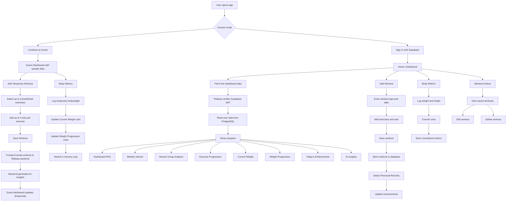
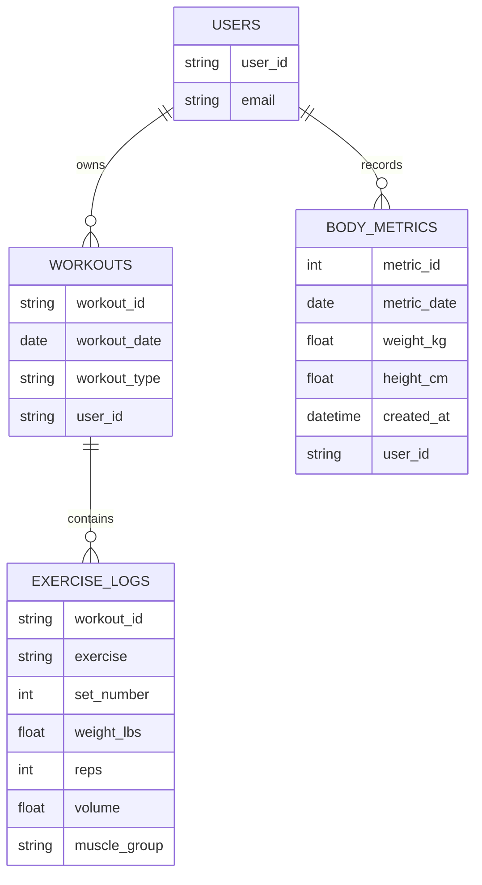
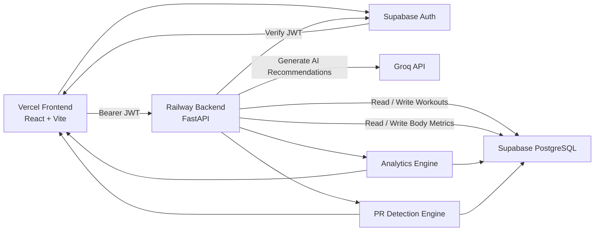

# AI Workout Analytics System

An end-to-end fitness analytics platform that combines workout tracking, bodyweight monitoring, interactive dashboards, and AI-powered coaching insights.

The application allows users to log workouts, analyze training trends, monitor muscle group volume, track exercise progression, monitor bodyweight changes, identify personal records (PRs), and receive personalized recommendations generated by AI.

---

## Live Demo

**Frontend (Vercel):** https://workout-analytics-dashboard-six.vercel.app/

---

# Features

## Authentication

* Secure sign-in using Supabase Authentication
* JWT verification on FastAPI backend
* Protected access to personal workout data
* Guest mode available for exploring the application

---

## Workout Tracking

* Session-based workout logging
* Enter workout date and workout type once per workout
* Add multiple exercises and sets
* Automatic volume calculation
* Automatic muscle group classification
* Persistent workout history stored in PostgreSQL

---

## Workout History

* View previous workouts
* Browse workout sessions
* View complete workout details
* Edit existing workouts
* Delete workouts

---

## Body Metrics Tracking

* Log bodyweight and height
* Supports:

  * lbs or kg
  * feet/inches or cm
* Automatic unit normalization
* Current Weight dashboard card
* Weight Progression chart
* Historical bodyweight tracking

---

## Personal Record (PR) Tracking

* Automatic PR detection
* No manual tracking required
* PRs calculated dynamically from workout history
* Trophy markers displayed on Exercise Progression charts
* Daily achievement tracking

---

## Today's Achievements

Displays notable accomplishments including:

* New exercise PRs
* Training milestones
* Volume achievements

When no achievements are detected:

> You're still showing up for yourself. That's still a worthy achievement. Keep going.

---

## Analytics Dashboard

### KPI Cards

* Total Workouts
* Total Volume
* Total Sets
* Current Weight

### Charts

* Weekly Volume Trend
* Muscle Group Distribution
* Exercise Progression
* Weight Progression

### Insights

* AI-generated training recommendations
* Training balance analysis
* Volume trend analysis
* Recovery recommendations

---

## Guest Mode

Users can explore the application without signing in.

Guest mode includes:

* Sample dashboard data
* Temporary workout logging
* Temporary body metric logging
* AI-generated insights
* In-memory storage only

Guest data is cleared when the page refreshes.

---

# Application Flow

---

# Database Design

---

# System Architecture

---

# Technology Stack

## Frontend

* React
* Vite
* Recharts
* Bootstrap

## Backend

* FastAPI
* SQLAlchemy
* Pandas

## Database

* Supabase PostgreSQL

## Authentication

* Supabase Authentication
* JWT Verification

## AI

* Groq API
* Llama Models

## Deployment

* Vercel
* Railway

---

# Analytics Generated

The platform automatically calculates:

* Training volume
* Weekly volume trends
* Total sets performed
* Exercise progression
* Muscle group distribution
* Workout frequency
* Bodyweight trends
* Personal records

---

# AI Coach

The AI Coach analyzes:

* Weekly volume changes
* Training consistency
* Muscle group balance
* Exercise progression
* Bodyweight trends
* Potential overtraining
* Potential undertraining
* Recent achievements

Example observations:

* Training volume increased 12% this week.
* Bodyweight decreased 2 lbs while maintaining strength.
* New PR achieved on Hip Thrust.
* Glutes continue to receive the highest training volume.

---

# Future Enhancements

* Exercise library with search
* Workout templates
* Nutrition tracking
* Goal setting
* Social sharing
* Advanced exercise analytics
* CSV export

---
